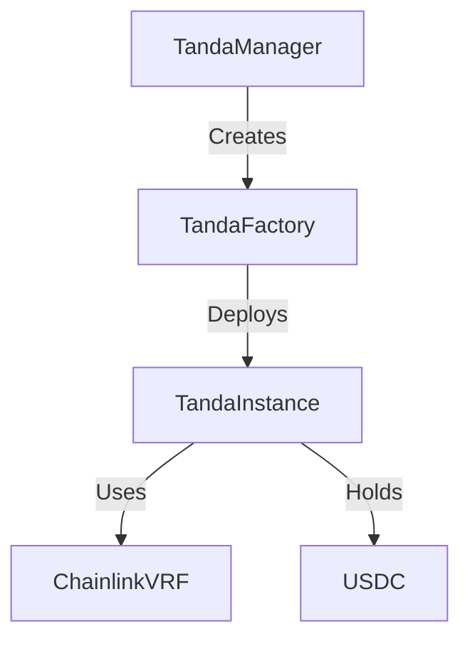

# **MiTanda: Trustless, Borderless Savings Circles**  
### *Onchain ROSCAs for the Modern World*  

  

## **Overview**  
MiTanda transforms traditional rotating savings and credit associations (ROSCAs) into **trustless, onchain smart contracts**. Built on **Base L2**, it solves the core problems of traditional tandas:  
- 🚫 No more trust issues (funds secured by smart contracts)  
- 🌍 Borderless participation (anyone with a wallet can join)  
- 🔍 Full transparency (all transactions onchain)  
- ⚖️ Automated fairness (provably random payout order)  

## **Tech Stack**  
- **Smart Contracts**: Solidity  
- **Framework**: Hardhat  
- **Network**: Base (Mainnet & Sepolia)  
- **Frontend**: Next.js  
- **Oracles**: Chainlink VRF (for random payout order)  
- **Stablecoins**: USDC support  

## **Smart Contract Features**  
✔ Funds held in **non-custodial smart contracts**  
✔ **Chainlink VRF** for provably fair payout selection  
✔ **Automated penalties** for late/missed payments  
✔ **USDC integration** for stable-value tandas  
✔ **Gas-optimized** for Base L2  

## **Development Setup**  

### **Prerequisites**  
- Node.js (v18+)  
- Yarn or npm  
- Hardhat  
- MetaMask (or other Web3 wallet)  

### **Installation**  
1. Clone repository:  
   ```bash
   git clone https://github.com/your-repo/mitanda-contract.git
   cd mitanda-contracts
   ```
2. Install dependencies:  
   ```bash
   yarn install
   ```
3. Set up environment variables (create `.env` file):  
   ```env
   BASE_SEPOLIA_RPC_URL=
   BASE_MAINNET_RPC_URL=
   ETHERSCAN_API_KEY=
   PRIVATE_KEY=
   CHAINLINK_SUBSCRIPTION_ID=
   VRF_COORDINATOR=
   GAS_LANE=
   CALLBACK_GAS_LIMIT=
   USDC_ADDRESS=
   ```

### **Deployment**  
Deploy to Base Mainnet:  
```bash
npx hardhat deploy --network baseMainnet --tags tanda-manager
```

### **Testing**  
Run tests on Base Mainnet fork:  
```bash
npx hardhat test --network baseMainnet
```

### **Verification**  
Verify contract on Basescan:  
```bash
npx hardhat verify --network baseMainnet DEPLOYED_CONTRACT_ADDRESS
```

## **Contract Architecture**  


## **Future Roadmap**  
- [ ] Onchain reputation system  
- [ ] Multi-chain deployment  
- [ ] Mobile wallet integration  
- [ ] Gasless transactions  

## **Contributing**  
We welcome contributions! Please:  
1. Fork the repo  
2. Create a feature branch (`git checkout -b feature/your-feature`)  
3. Commit changes (`git commit -m 'Add amazing feature'`)  
4. Push to branch (`git push origin feature/your-feature`)  
5. Open a Pull Request  

## **License**  
MIT  

## **Contact**    
- **Website**: [https://mitanda.org](https://mitanda.org)  
- **Twitter**: [@basednouns](https://x.com/basednouns)  

---

🚀 **Join the onchain savings revolution today!**  

*"Bank the unbanked, without the banks."*